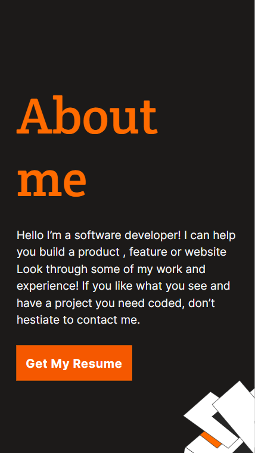

# Portfolio: mobile version

"Your portfolio is one of the most powerful tools in your software developer toolbox; it’s the easiest way of showing what you’re truly capable of as a developer, and is a quick and simple way for recruiters and hiring managers to get an idea of what you can bring to their teams." - Microverse

This project is the second step of building my portfolio. For this project, I have to build the "Works" and "About me" sections of the template picked in the first step ([I picked #2](https://www.figma.com)) from scratch using what we learned in previous HTML & CSS lessons.

## Built With

- HTML/CSS
- Node.js

## Live Demo

## Getting Started

To get a local copy up and running follow these simple example steps.
- Clone repo into your machine. For this, I recommend the following steps:
  - Open a terminal of your choice (e.g. VS Code integrated terminal)
  - Select the destination folder (On windows, run cd "*Destination folder*")
  - Run git clone https://github.com/dicodiaz/Portfolio
- Open the destination folder in your preferred file explorer
- Open folder "Portfolio"
- Open index.html

### Prerequisites

Any web browser will do.

### Setup

Follow the steps described before.

### Install

N/A

### Usage

N/A

### Run tests

N/A

### Deployment

N/A

## Authors

👤 **Dico Diaz Dussan**

- GitHub: [@dicodiaz](https://github.com/dicodiaz)
- Twitter: [@DicoDiaz1](https://twitter.com/DicoDiaz1)
- LinkedIn: [Dico Diaz Dussan](https://www.linkedin.com/in/dico-diaz-dussan-476106a6/)

## 🤝 Contributing

Contributions, issues, and feature requests are welcome!

Feel free to check the [issues page](../../issues/).

## Show your support

Give a ⭐️ if you like this project!

## Acknowledgments

My learning partners and my stand-up team partners.

## 📝 License

This project is [MIT](./MIT.md) licensed.
