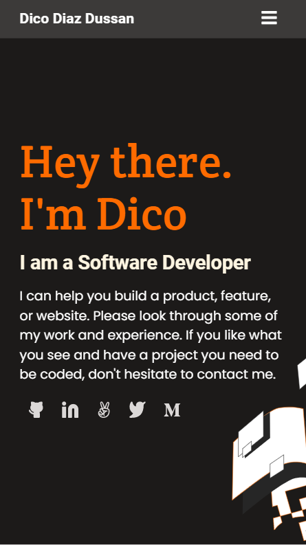

# Portfolio

"Your portfolio is one of the most powerful tools in your software developer toolbox; it’s the easiest way of showing what you’re truly capable of as a developer, and is a quick and simple way for recruiters and hiring managers to get an idea of what you can bring to their teams." - Microverse

This project consists in building my personal portfolio from scratch, choosing one of the [Microverse templates](https://www.figma.com/file/l7SqJ3ZfkAKih9sFxvWSR4/Microverse-Student-Project-1?node-id=1%3A1471) and sticking to that design (I chose Template 2). For this, I followed these steps:

1. Build the toolbar and headline sections of the mobile version.
2. Build the "Works" and "About me" sections of the mobile version.
3. Build the contact form and to finish the mobile version of the mobile version.
4. Build the desktop version.
5. Deploy the application in GitHub Pages.
6. Evaluate accesibility.

## Mobile

## Desktop

## Built With

- HTML5
- CSS3
- Visual Studio Code
- Git & Github

## Live Demo

[Live Demo Link](https://dicodiaz.github.io/Portfolio/)

## Getting Started

To get a local copy up and running follow these simple example steps.

- Clone repo into your machine. For this, I recommend the following steps:
  - Open a terminal of your choice (e.g. VS Code integrated terminal)
  - Select the destination folder (On windows, run cd "_Destination folder_")
  - Run git clone https://github.com/dicodiaz/Portfolio
- Open the destination folder in your preferred file explorer
- Open folder "Portfolio"
- Open index.html

### Prerequisites

Any modern web browser will do.

### Setup

Follow the steps described before.

### Install

N/A

### Usage

N/A

### Run tests

N/A

### Deployment

N/A

## Authors

👤 **Dico Diaz Dussan**

- GitHub: [@dicodiaz](https://github.com/dicodiaz)
- Twitter: [@DicoDiaz1](https://twitter.com/DicoDiaz1)
- LinkedIn: [Dico Diaz Dussan](https://www.linkedin.com/in/dico-diaz-dussan-476106a6/)

## 🤝 Contributing

Contributions, issues, and feature requests are welcome!

Feel free to check the [issues page](../../issues/).

## Show your support

Give a ⭐️ if you like this project!

## Acknowledgments

- Hat tip to anyone whose code was used
- Inspiration
- Microverse program
- My code reviewers

## 📝 License

This project is [MIT](./MIT.md) licensed.
